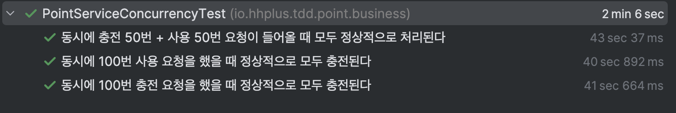

# 동시성 제어 방식 분석 및 보고서

## 1. 서론
- 동시성 제어는 여러 스레드가 공유 자원에 접근할 때 발생할 수 있는 문제를 해결하기 위해 필수적인 개념입니다. 
- 해당 보고서에서는 포인트 시스템을 구현한 `PointService` 클래스와 `PointServiceConcurrencyTest` 테스트 코드에 적용된 동시성 제어 방식을 분석합니다.


## 2. 시스템 개요
`PointService`는 사용자의 포인트를 충전하고 사용할 수 있는 기능을 제공하는 서비스입니다. 이 서비스는 다음과 같은 주요 구성 요소로 이루어져 있습니다.
- `UserPointRepository`: 사용자 포인트 정보를 `Map<Long, UserPoint>` 자료구조에 관리합니다.
- `PointTransactionHandler`: 포인트 충전 및 사용에 대한 실제 비즈니스 로직을 처리합니다.
- `PointHistoryHandler`: 포인트 거래 이력을 관리합니다.


## 3. 동시성 제어 방식
### 3.1 Lock을 이용한 동시성 제어 ([관련 커밋](https://github.com/wisdom08/tdd-jvm/commit/4ed0aefbcf29b28dd3cac77f9fd8aabffdb4e23a))
`PointService`는 `ReentrantLock`을 사용하여 동시성 제어를 구현하고 있습니다. 다음은 `handleTransactionWithLock` 메서드의 주요 내용입니다.
```java
private UserPoint handleTransactionWithLock(long userId, long point, TransactionType transactionType) {
    Lock lock = userLock.computeIfAbsent(userId, k -> new ReentrantLock());
    lock.lock();

    try {
        return pointTransactionHandler.handleTransaction(userId, point, transactionType);
    } finally {
        lock.unlock();
    }
}
```
- Lock 객체 생성: `ConcurrentHashMap`을 사용하여 각 사용자 ID에 대해 Lock 객체를 생성합니다. 이는 멀티스레드 환경에서도 스레드 안전하게 접근할 수 있도록 합니다.
- Lock 획득 및 해제: 스레드가 Lock을 획득하면 해당 사용자에 대한 포인트 거래를 안전하게 수행하고, 작업이 끝나면 Lock을 해제합니다. 이 과정에서 `try-finally` 구문을 사용하여 예외 발생 시에도 Lock이 항상 해제되도록 보장합니다.

### 3.2 동시성 테스트
`PointServiceConcurrencyTest` 클래스에서는 여러 테스트 케이스를 통해 동시성 상황을 검증합니다.
- 충전 요청 테스트: 100개의 스레드가 동시에 사용자에게 포인트를 충전하는 테스트가 포함되어 있습니다. 각 스레드는 100포인트를 충전하며, 최종적으로 10000포인트가 충전되는지를 검증합니다.
- 사용 요청 테스트: 100개의 스레드가 동시에 포인트를 사용하는 테스트를 통해, 잔고가 정확히 0이 되는지를 검증합니다.
- 충전 및 사용 요청 혼합 테스트: 50번의 충전과 50번의 사용 요청을 동시에 처리하며, 최종적으로 계산된 포인트가 예상과 일치하는지를 확인합니다.


## 4. 장점 및 단점
### 4.1 장점
- 스레드 안전성: Lock을 사용하여 포인트 거래의 스레드 안전성을 보장합니다. 여러 스레드가 동시에 접근하더라도 데이터 일관성을 유지할 수 있습니다.
- 높은 가시성: 각 사용자의 Lock이 별도로 관리되므로, 다른 사용자의 거래에는 영향을 미치지 않으며, 성능이 상대적으로 향상됩니다.

### 4.2 단점
- 성능 저하: Lock을 사용하는 것은 성능에 부정적인 영향을 미칠 수 있습니다. 특히, Lock을 오랫동안 보유할 경우 다른 스레드의 대기 시간이 길어져 시스템의 전체 성능이 저하될 수 있습니다.
- 교착 상태(Deadlock): Lock을 잘못 관리할 경우 교착 상태에 빠질 수 있는 위험이 있습니다. 예를 들어, 두 개 이상의 스레드가 서로의 Lock을 기다리는 상황이 발생할 수 있습니다. 하지만 `tryLock()`을 사용하면 교착 상태를 어느 정도 완화할 수 있습니다.

## 5. 결론
- `PointService`에서 적용된 동시성 제어 방식은 Lock을 활용하여 포인트 거래의 스레드 안전성을 보장하고 있습니다. 
- 그러나 Lock 사용에 따른 성능 저하 및 교착 상태 발생 가능성에 대한 주의가 필요합니다. 
- 따라서, 향후 시스템 확장을 고려할 때는 Lock 이외에 다른 동시성 제어 기법(e.g: Optimistic Locking, Versioning 등)을 검토하는 것이 좋습니다.

---

### 부록 `tryLock()`을 이용한 동시성 제어
- `tryLock()`을 활용하면 Lock을 얻지 못했을 때의 대처 방안을 보다 유연하게 설계할 수 있습니다. 예를 들어, 다음과 같은 대처 방법을 생각해 볼 수 있습니다.
    - 재시도 로직 추가: Lock 획득에 실패할 경우, 일정 시간 후에 다시 시도하도록 설정할 수 있습니다.
    - 대기 처리: 다른 스레드가 Lock을 해제할 때까지 대기하도록 설정할 수 있습니다. 이 경우 `tryLock()`의 두 번째 인자를 사용하여 대기 시간을 설정할 수 있습니다.
    - Fallback 처리: Lock을 얻지 못할 경우 대체 로직(e.g: 캐시 사용 등)을 수행하도록 설계할 수 있습니다.

#### 장점
- 교착 상태 방지: `tryLock()`을 사용하여 교착 상태를 방지할 수 있습니다. Lock을 획득하지 못한 경우 일정 시간 이후 실패 처리함으로써 시스템이 교착 상태에 빠지지 않도록 도와줍니다.

#### 단점
- 추가적인 예외 처리: `tryLock()`을 사용할 경우 Lock 획득 실패에 대한 예외 처리를 고려해야 하므로 코드가 복잡해질 수 있습니다.

```java
private final Map<Long, Lock> userLock = new ConcurrentHashMap<>();
private static final int MAX_RETRIES = 5;
private static final long RETRY_DELAY_MS = 200;

private UserPoint handleTransactionWithLock(long userId, long point, TransactionType transactionType) {
    Lock lock = userLock.computeIfAbsent(userId, k -> new ReentrantLock());

    for (int attempt = 0; attempt < MAX_RETRIES; attempt++) {
        if (tryAcquireLock(lock)) {
            try {
                return pointTransactionHandler.handleTransaction(userId, point, transactionType);
            } finally {
                lock.unlock();
            }
        }
        waitBeforeRetry(); // 재시도 전에 대기
    }
    throw new IllegalStateException("사용자 ID: " + userId + "에 대해 " + MAX_RETRIES + "회 시도한 후 락을 획득할 수 없습니다");
}

private boolean tryAcquireLock(Lock lock) {
    try {
        return lock.tryLock(500, TimeUnit.MILLISECONDS);  // 일정 시간 동안 대기 후 시도
    } catch (InterruptedException e) {
        Thread.currentThread().interrupt();
        return false;
    }
}

private void waitBeforeRetry() {
    try {
        Thread.sleep(RETRY_DELAY_MS * (attempt + 1)); // 시도할 때마다 대기 시간을 증가
    } catch (InterruptedException e) {
        Thread.currentThread().interrupt();
        throw new IllegalStateException("락 재시도 중 스레드가 중단되었습니다");
    }
}
```